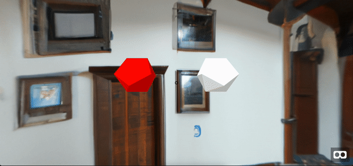

# AIwaska, Concept Game
In the future, entertainment will be all about personalization. AIwaska is a concept game that showcases this capability by using a Generative-AI engine to create an immersive, 360, interactive world based on a user prompt. This technology can be used by game developers to reduce production costs, or by users who want to explore custom worlds tailored to their desires.


### Example Prompt 1: Middle Ages town hall



### Example Prompt 2: Middle Ages town hall, with a psychedelic teleport door that opens up to the future


# How to Run:

### Install:
```
git clone https://github.com/adamcohenhillel/aiwaska.git
```
```
cd aiwaska/client
```
```
npm install
```
```
npm start
```

### Config:
`OPENAI_KEY`
FRAME_SIZE = 1024
FRAME_COUNT = 3
VARIATIONS = 30
```

# How it Works:
User Prompt -> GPT Generate "Game" frames -> Dall-E converts to visual, 360 frames -> Itreates the process for effects